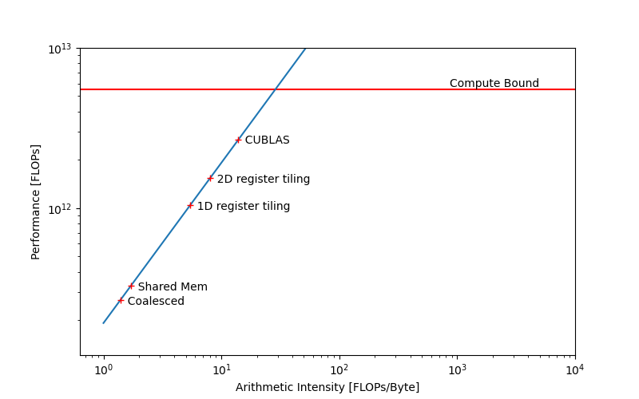

*** Work in Progress ***

Performance data on RTX3050Mobile for A(M x P) * B(P x N) = C(M x N). Here M = N = P = 1024.

The max theoretical performance of a RTX3050 Mobile is 5.501 TFLOPS (FP32 / float) and global memory bandwidth of 192 GBytes/s.
Source : https://www.techpowerup.com/gpu-specs/geforce-rtx-3050-mobile.c3788

The time-complexity of a simple MM is O(N^3). For every entry in resulting matrix, there is N time product and near similar amount summing operation. So there are 2N FLOP for every entry in resulting matrix and therefore 2N^3 FLOP for the entire matrix.

Given theoretical peak performance (or the ROOF in roofline model), we can compute relative performance if time taken by the kernel is known using

$$ \text{AGAINSTROOF [PERCENT]} = \frac{(2 * N^3) [FLOP]} {\text{TIME [s] *  GPUPEAKPERFORMANCE [FLOPs]}} * 100 [\text{PERCENT}] $$

`nvcc matmul.cu -o matmul -arch=sm_80 -lcublas`

`nsys profile -o nsys_matmul --stats=true ./matmul`

`ncu -o ncu_matmul  -f --clock-control none ./matmul`

`ncu-ui ncu_matmul.ncu-rep`

CUBLAS time taken = 0.802 ms (uses `ampere_sgemm_128x64_nn` as seen from nsys data). In this case, CUBLAS performs at about roughly 50% of the roofline performance for this GPU.

For 2D register tiling, number of threads is a function of SM block size and register tile size. Therefore, carefully control these numbers to achieve 128-256 threads per block, which usually is a sweet spot for CUDA.

|KERNEL    				|BANDWIDTH     	|TIME (ms) 	|AGAINST_CUBLAS (%)
| --------------------- 		| ------------- | ------------- | ----------------
|naiveMM   				|		|71.00       	| 1.13
|coalescedMM				|		| 8.04		|10.02
|sharedMM				|	        | 6.54	        |12.26
|1D Register tiling			|	        | 2.064	        |38.85
|2D register tiling (no sA transpose)	|		| 1.394		|57.50
|2D register tiling (sA transpose)	|		| 1.737		|46.17
|					|		|		|
|					|		|		|
|					|		|		|
|sharedMM+2Dblocktiling+FLOAT4		|		| 1.105		|72.50

Roofline model

